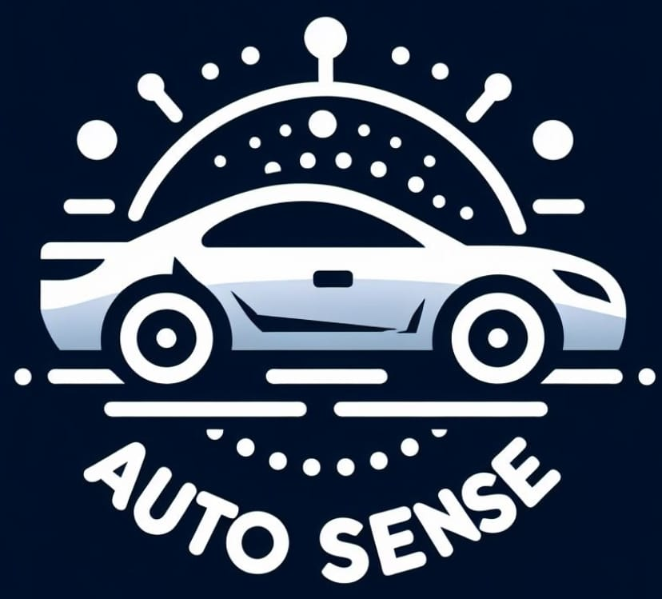

  

## Olá senhoras e senhores!!

Somos um grupo de estudantes da faculdade **FIAP**, onde esse projeto é nossa solução para o Challenge de 2024.

### Membros:
- Erick Alves - <a href="https://github.com/Erick0105">Erick0105</a> - Rm 5568682
- Vicenzo Oliveira - <a href="https://github.com/fFukurou">fFukurou</a> - Rm 554833
- Luiz Henrique - <a href="https://github.com/LuizHNR">LuizHNR</a> - Rm 556864

## Sobre o projeto
No challenge para a turma de ADS do ano 2024 foi proposto pela Porto Seguro sendo apresentado a seguinte problemática, Como oferecer um canal digital para gerar agilidade e assertividade no diagnóstico do problema do veículo, sem intervenção humana.
Não iremos falar atualmente qual a nossa solução para este problema mas futuramente iremos junto com dos repositorios.
#### Linguagens Utilizadas

<code></code>
<code></code>
<code></code>
<code></code>

